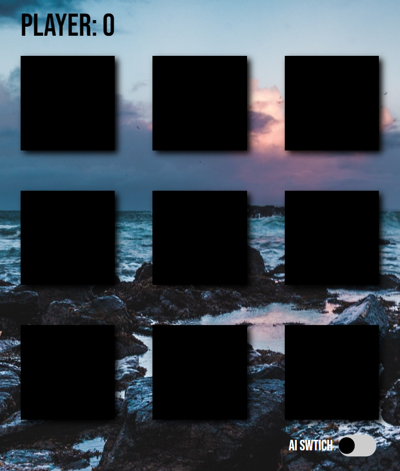

**Ben Purvis
7/24/2020**

**TicTacToe**   
This game includes these modes one vs one mode and human vs computer. 
All played locally. The computer player is using the Minimax algorithm.

   

**Resources I've used:**   
https://www.youtube.com/watch?v=trKjYdBASyQ&t=1408s   
https://www.youtube.com/watch?v=l-hh51ncgDI&t=285s    
https://www.geeksforgeeks.org/minimax-algorithm-in-game-theory-set-1-introduction/

**MiniMax Algorithm:** Ⓜ️Ⓜ️  
The Maximizer = AI.  
The Minimizer = player.  

The maximizer tries to get the highest score possible while the
minimizer does the opposite, getting lowest score. 
Every board state has a value associated with it. In a state where the
maximizer has an advantage the score of the board positive value, if the 
minimizer can win in that board state, the score is a negative value.

This method recursively calls it self on the max and min player scanning the 
board locations and creating a score for each player (minimizing, maximizing) based
on the board state.

**Known bugs**  
Board elements aren't static positonally they move or wrap  
when there's a different screen size. There is a media query in the  
css for mobile.
